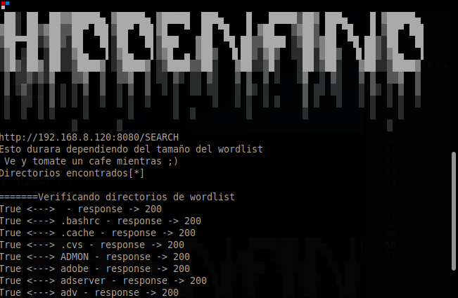

<h1>HiddenFind</h1>

Hidden Find es una herramienta que te ayuda a encontrar directorios
ocultos dentro de webs.
Trae consigo integrado una carpeta con diferentes wordlist para que
puedas buscar los directorios sin necesidad de instalar los wordlist
de manera individual a la herramienta.
Esta es apenas la primera version de la herramienta, por lo tanto
pueden existir errores.
Para ver los comandos solo basta con hacer un   
python3 setup.py --help
Ahora mi herramienta trae la version 2.0.0, entre sus nuevas caracteristicas
es que te guarda un log al momento de terminar el proceso.
Ahora ya no debes esperar hasta el final para ver los directorios
encontrados ya que la herramienta lo presentara de manera simultanea.
Tambien la velocidad de las peticiones ha aumentado, ya no tiene un limitante.
Y te mostrara como utilizar la herramienta 

